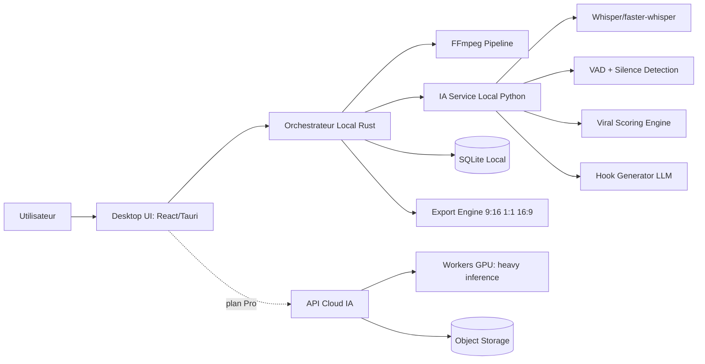

# Architecture technique ultra détaillée — Monteur IA (Desktop)

## 1) Objectifs d’architecture

- Livrer un **MVP en 4 mois** avec une base robuste et évolutive.
- Prioriser le **traitement local** pour la vitesse/perception utilisateur.
- Isoler l’IA avancée pour activer un modèle **hybride local + cloud**.
- Garder une architecture modulaire pour ajouter rapidement des features (hooks, viral score, templates).

## 2) Stack recommandée (version pragmatique)

- **Desktop app** : Tauri + React + TypeScript
- **Orchestration locale** : Rust (cœur Tauri commands)
- **Traitement vidéo/audio** : FFmpeg (binaire embarqué)
- **Moteur IA local** : Python microservice (FastAPI)
- **Speech-to-text** : Whisper (faster-whisper local par défaut, API fallback)
- **VAD / silences** : WebRTC VAD + analyse RMS via FFmpeg
- **Cloud optionnel (Pro)** : API Node.js + workers GPU (jobs asynchrones)
- **Persistance locale** : SQLite (projets + métadonnées + cache)
- **Observabilité** : Sentry desktop + logs structurés JSON

## 3) Vue logique (diagramme)



## 4) Architecture des modules (MVP → Scale)

### A. Desktop Shell (Tauri)

Responsabilités :
- gestion projet (import, état, historique),
- exécution des jobs locaux,
- communication UI ↔ orchestrateur,
- gestion licence / plan.

Composants :
- `ProjectManager` : crée/charge/sauvegarde un projet,
- `JobRunner` : enfile les tâches (transcription, silence-cut, export),
- `MediaIndexer` : extrait métadonnées (fps, bitrate, durée, pistes),
- `PresetManager` : presets reels/shorts.

### B. IA Locale (Python FastAPI)

Endpoints recommandés :
- `POST /transcribe`
- `POST /detect-silences`
- `POST /score-moments`
- `POST /generate-hooks`

Structure interne :
- `transcription/` (Whisper)
- `audio_features/` (RMS, pitch proxy, peaks)
- `nlp/` (keywords émotionnels, punchlines)
- `ranking/` (score final par segment)

### C. Pipeline FFmpeg

Étapes principales :
1. normalisation (audio sample rate + loudness),
2. détection zones silencieuses,
3. coupe automatique,
4. burn-in sous-titres,
5. reframe format (9:16, 1:1, 16:9),
6. export multi-résolutions.

### D. Cloud IA (phase 2+)

- Workers GPU pour tâches coûteuses (diarization avancée, hook LLM haut débit),
- API job queue (`queued -> processing -> done`),
- téléchargement des artifacts (JSON segments + captions + metadata).

## 5) Contrats de données clés

### `Project`

```json
{
  "id": "proj_123",
  "sourceVideoPath": "/path/video.mp4",
  "durationSec": 3720,
  "language": "fr",
  "createdAt": "2026-01-10T10:00:00Z"
}
```

### `TranscriptSegment`

```json
{
  "start": 12.2,
  "end": 15.9,
  "text": "Le vrai problème, c'est la distribution.",
  "confidence": 0.93,
  "speaker": "S1"
}
```

### `ViralCandidate`

```json
{
  "start": 145.0,
  "end": 176.0,
  "score": 0.82,
  "reasons": ["audio_peak", "emotional_phrase", "high_speech_rate"],
  "suggestedHook": "La pire erreur qui m'a coûté 6 mois"
}
```

## 6) Algorithme de détection virale (v1)

Score global segment `S` :

`Score(S) = 0.30*AudioPeak + 0.25*LexicalEmotion + 0.20*SpeechRateDelta + 0.15*PauseContrast + 0.10*VisualMotion`

Détails :
- `AudioPeak` : pics RMS normalisés,
- `LexicalEmotion` : présence de termes émotionnels + patterns narratifs,
- `SpeechRateDelta` : accélération/décélération du débit,
- `PauseContrast` : contraste silence → phrase forte,
- `VisualMotion` : variation motion vectors (optionnel v1).

Post-traitement :
- merge de segments proches (< 4 sec),
- suppression segments trop courts (< 12 sec),
- diversification (éviter 5 clips quasi identiques).

## 7) Roadmap technique alignée business

### Phase 1 (0–4 mois) — MVP vendable

Livrables :
- import vidéo + indexing,
- suppression auto des silences,
- sous-titres auto,
- export 9:16 / 1:1 / 16:9,
- auto-découpage par énergie audio + durée cible.

KPIs :
- temps de traitement < 0.7x durée vidéo (machine standard),
- crash-free sessions > 98%,
- taux export réussi > 95%.

### Phase 2 (4–8 mois) — Différenciation IA

Livrables :
- viral moments scoring,
- hooks automatiques,
- auto-zoom parlant,
- templates verticalisés (podcast/interview/gaming).

KPIs :
- CTR moyen des clips +20% vs baseline client,
- adoption feature IA > 35% users actifs.

### Phase 3 (8–12 mois) — Scale

Livrables :
- option cloud storage,
- exports directs plateformes,
- analytics basiques,
- API agences.

KPIs :
- churn mensuel < 7%,
- temps export moyen réduit de 25%,
- marge brute > 70%.

## 8) Qualité, sécurité, performance

- sandbox chemins fichiers (éviter accès arbitraire),
- signature binaire desktop,
- chiffrement local des tokens/API keys,
- queue avec retry exponentiel,
- checksum des médias importés,
- tests e2e pipeline (fichiers courts de référence).

## 9) Plan d’exécution 6 sprints (2 semaines)

1. **Sprint 1** : shell desktop + import + métadonnées + DB.
2. **Sprint 2** : transcription + sous-titres exportables.
3. **Sprint 3** : silence detection + auto-cut pipeline.
4. **Sprint 4** : exports multi-format + presets.
5. **Sprint 5** : scoring viral v1 + ranking clips.
6. **Sprint 6** : hooks auto + polish UX + paywall.

## 10) Décisions stratégiques recommandées

- Commencer avec **Tauri + Rust + Python IA** (performance + footprint).
- Garder le cloud uniquement pour features premium lourdes.
- Optimiser la perception de vitesse (prévisualisation rapide avant rendu final).
- Vendre la promesse “1 long format -> 10 shorts” dans tout le produit.

---

Si tu veux la suite, prochaine étape utile :
- diagramme de séquence complet (`import -> analyse -> ranking -> export`),
- schéma DB SQLite,
- spec API JSON détaillée endpoint par endpoint.
